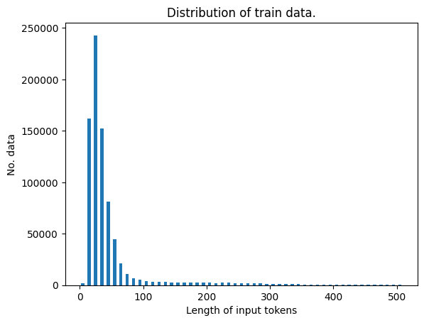
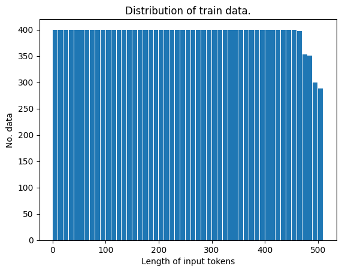
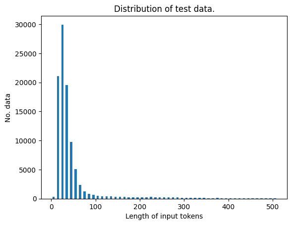
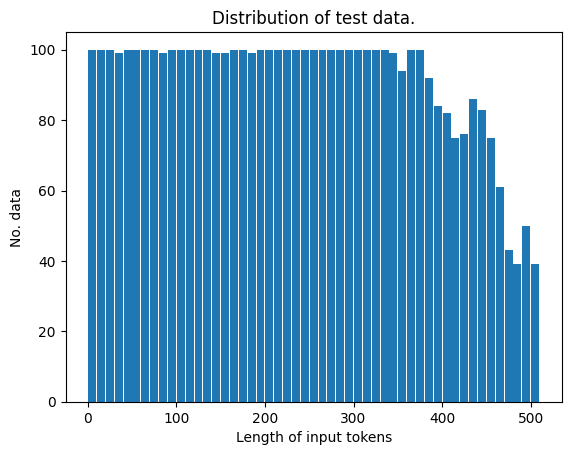

# 부산대학교 정보컴퓨터공학부 2025 전기 졸업과제 

## 1. 주제
#### 공공데이터를 활용한 KoBERT 파인튜닝과 한국어 키워드 분석 및 대쉬보드 시각화

## 2. 시스템 구상도

## 3. 멤버
| 박준혁 | 이차현 | 임성표 |
|:-------:|:-------:|:-------:| 
||||
| eppi001004@gmail.com | chahyun20@naver.com | lsp11121@gmail.com |
| 자연어처리 | 프론트엔드 | 백엔드 |

## 4. 개발 환경
파이썬 3.12.9

파이토치 2.5.1(stable)

transforemrs 4.49.0

## 5. 데이터
|  | 023.국회 회의록 기반 지식검색 데이터 | 143.민원 업무 효율, 자동화를 위한 언어 AI 학습데이터 | 115.법률-규정 텍스트 분석 데이터_고도화_상황에 따른 판례 데이터 | 전체 데이터 (전처리 전) | 전체 데이터 (전처리 후) |
| :---: | :---: | :---: | :---: | :---: | :---: |
| train 데이터 수 | 70466 | 800000 | 20160 + 53209 | 943835 | 20337 |
| test 데이터 수 | 8800 | 100000 | 6651 | 115451 | 4845 |

### 전체 데이터(정제 전 후)

| | 데이터 전처리 전 분포 | 데이터 전처리 후 분포 |
| :---: | :---: | :---: |
| train |  | |
| test |  | |
