# 부산대학교 정보컴퓨터공학부 2025 전기 졸업과제 


**KoKeyBERT (코키 버트) (웰시코기 + 버트)**

## 1. 개요

### 공공데이터를 활용한 KoBERT 파인튜닝과 한국어 키워드 분석 및 대쉬보드 시각화

1.1. 개발배경 및 필요성

기존 KeyBERT 라이브러리는 CLS 토큰과 각 토큰들 간의 벡터 유사도를 측정하는 방식으로 키워드를 추출하기 때문에 입력 문장이 길어지면 계산에 시간이 많이 소요된다는 단점이 있습니다. 또한 KeyBERT에서 내부적으로 사용하는 모델들은 keyword extraction이라는 task에 특화되어 있지 않은 사전학습 모델들이기 때문에 도메인이나 언어별 특수성을 반영하기 어렵습니다. 특히, 형태소 단위로 의미가 구성되는 한국어의 특성상 이러한 방식은 키워드 추출의 정확도가 떨어질 수 있습니다. 따라서 한국어에 특화된 KoBERT와 CRF를 결합하여 보다 효율적이고 정확한 키워드 추출 모델을 구현하고자 하였습니다. 이를 통해 한국어 텍스트를 분석하는 서비스를 만들어보고자 하였습니다.


1.2. 개발 목표 및 주요 내용

사용자가 한국어 텍스트를 입력하면 키워드를 추출하고, 해당 키워드가 추출된 이유를 설명하는 기능을 구현하고자 합니다. 또한 텍스트를 구성하는 단어들을 품사별로 분석하여 시각화하는 기능을 구현하고자 합니다. 이를 통해 사용자의 텍스트 분석을 돕습니다.


1.3. 세부내용

- 자연어 처리: 데이터 전처리, KoBERT와 CRF를 결합한 키워드 추출모델 구현. 키워드 추출 설명 방법론 연구.
- 백엔드: Django + Pytorch로 AI 모델 API화, FastAPI로 API 서버 구현. Postgresql로 데이터베이스 구축.
- 프론트엔드: React 및 TypeScript로 반응형 UI 구현.


1.4. 주차 별 계획 및 진행사항 (수정 가능)

| 주차 | 키워드 | 계획 | 진행 내역 |
|:-------:|:-------:|:-------:|:-------:|
| 1주차 (2025.5.5 ~ 2025.5.11)| 데이터 | 데이터 전처리 | ✅ |
| 2주차 (2025.5.12 ~ 2025.5.18)| 데이터 | 데이터 전처리 | ✅ |
| 3주차 (2025.5.19 ~ 2025.5.25)| 모델 | 모델 설계 | |
| 4주차 (2025.5.26 ~ 2025.6.1)| 모델 | 모델 구현 | |
| 5주차 (2025.6.30 ~ 2025.7.6)| 모델 | 모델 학습 | |
| 6주차 (2025.7.7 ~ 2025.7.13)| 모델 | 모델 학습 | |
| 7주차 (2025.7.14 ~ 2025.7.20)| 모델 | 모델 평가 | |
| 8주차 (2025.7.21 ~ 2025.7.27)| 논문 | 키워드 확장 방법론 학습 | |
| 9주차 (2025.7.28 ~ 2025.8.3)| 논문 | 키워드 확장 방법론 설계 | |
| 10주차 (2025.8.4 ~ 2025.8.10)| 논문 | 키워드 확장 방법론 구현 | |
| 11주차 (2025.8.11 ~ 2025.8.17)| 논문 | 키워드 확장 방법론 평가 | |
| 12주차 (2025.8.18 ~ 2025.8.24)| 모델 | 모델 API화 | |
| 13주차 (2025.8.25 ~ 2025.9.1)| 모델 | 모델 배포 | |


## 2. 시스템 구상도


## 3. 개발 환경
```
NLP
python 3.12.9
torch 2.5.1(stable)
transformers 4.49.0
torchcrf 1.1.0

BackEnd

FrontEnd
```

## 4. 데이터
|  | 023.국회 회의록 기반<br>지식검색 데이터 | 143.민원 업무 효율,<br>자동화를 위한 언어 AI 학습데이터 | 115.법률-규정 텍스트 분석<br>데이터_고도화_상황에 따른 판례 데이터 | 전체 데이터<br>(전처리 전) | 전체 데이터<br>(전처리 후) |
| :---: | :---: | :---: | :---: | :---: | :---: |
| train<br>데이터 수 | 70466 | 800000 | 20160 + 53209 | 943835 | 20337 |
| test<br>데이터 수 | 8800 | 100000 | 6651 | 115451 | 4845 |

### 전체 데이터(정제 전 후)

| | 데이터 전처리 전 분포 | 데이터 전처리 후 분포 |
| :---: | :---: | :---: |
| train | 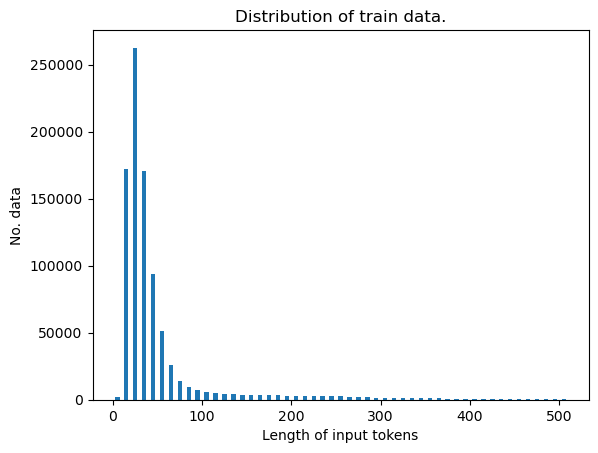 | 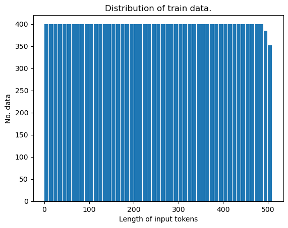|
| test | 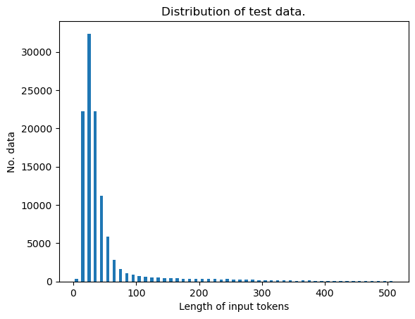 | 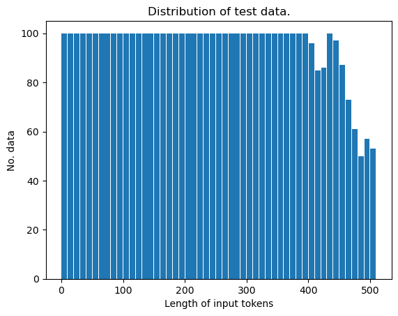|

## 5. 학습

### 5.1 학습 디렉토리로 이동

```bash
cd PROJECT_DIR/nlp
```

### 5.2 학습 실행

```bash
python train.py --train_data_path training_data.json \
--batch_size 64 \
--split_ratio 0.1 \
--train_logger_name logger_name \
--num_warmup_steps 375 \
--val_freq 300 \
--save_freq 300
```

### 5.3 학습 세부사항

- Batch Size: `64`
- Train/Validation Split: `90% / 10%`
- Number of Epochs: `12`
- Learning Rate: `5e-5`
- Warm-up Steps: `375` (전체 스텝의 약 10%)
- Validation Frequency: `300` 스텝마다 검증 수행
- Model Saving Criteria:
  - `300` 스텝마다 모델 저장
  - Validation loss가 최고 성능 모델보다 낮아질 경우 Best 모델로 저장
- Random Seed: `42`
- Device: `cuda` (Google Colab A100 환경)
- Data Loader Workers: `8`
- 학습 소요 시간: 약 `2시간`

### 5.4 학습 결과

- Loss 값을 통해 Best Model을 선정하였습니다.
- 2 epoch 이후 Validation Loss 값이 증가하여 overfitting이 발생하였음을 확인 할 수 있습니다.

| | |
| :---: | :---: |
| Loss | Accuracy | 
| 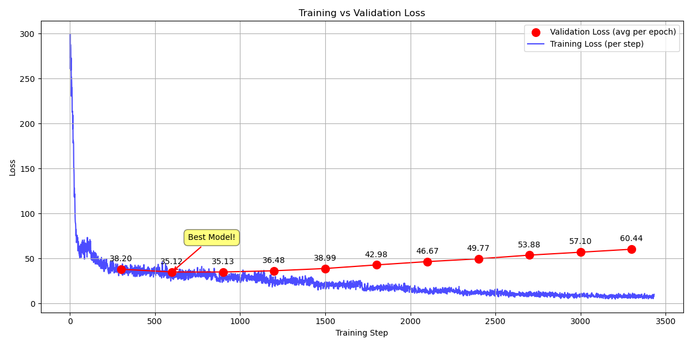 | 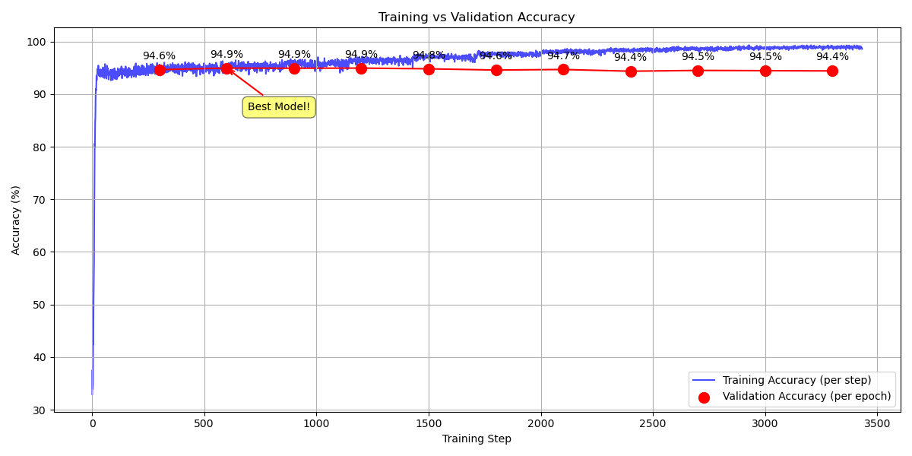 |

## 6. 평가

### 6.1 실험 환경 및 데이터
- 테스트 데이터: 총 4845개 샘플
- 평가 모델: KeyBERT(3개 키워드), KeyBERT(6개 키워드), KoKeyBERT
- 평가 기준: Precision, Recall, F1 Score, Confusion Matrix(혼동 행렬)

### 6.2 모델별 성능 요약

| 모델명                | Precision | Recall | F1 Score | TP    | FP     | FN     | 추론 시간(T4 기준) |
|----------------------|-----------|--------|----------|-------|--------|--------|--------|
| KeyBERT(3words)      | 0.0807    | 0.1420 | 0.1029   | 2316  | 26378  | 13990  | 3분57초 |
| KeyBERT(6words)      | 0.1041    | 0.0927 | 0.0981   | 1511  | 13000  | 14795  | 4분 4초 |
| KoKeyBERT            | **0.4848<br>(40%p)**    | **0.2263<br>(8%p)** | **0.3086<br>(20%p)**   | **3690**  | **3921**   | **12616**  | **1분 38초<br>(x2.4)** |

- **KeyBERT(3words)**: 키워드 개수를 3개로 제한한 경우, Precision은 낮으나 Recall이 상대적으로 높음.
- **KeyBERT(6words)**: 키워드 개수를 6개로 확장하면 Precision은 소폭 감소하나, Recall은 증가.
- **KoKeyBERT**: Precision, Recall, F1 모두 KeyBERT 대비 월등히 높음. 특히 Precision이 크게 향상됨.

### 6.3 시각화 결과

- **모델별 혼동 행렬**

|KoKeyBERT|KeyBERT(3words)|KeyBERT(6words)|
|:---:|:---:|:---:|
 | 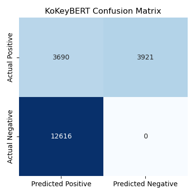 | 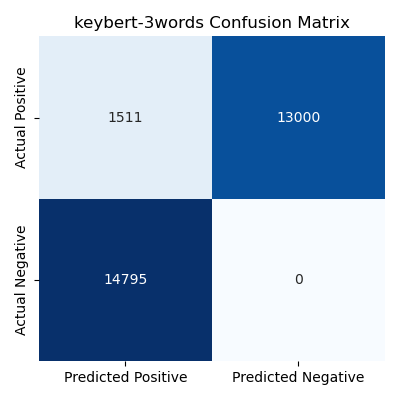 |  | 

- #### 성능 지표

| Precision | Recall | F1 Score | Inference Time |
|-----------|---------|-----------|-----------|
| 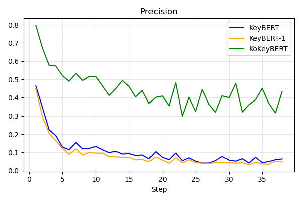 | 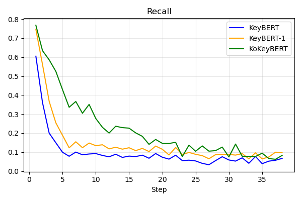 | 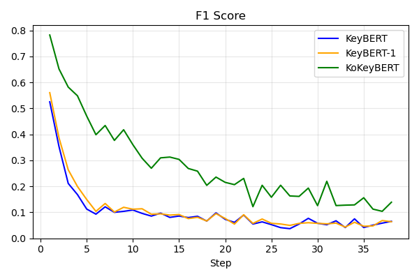 | 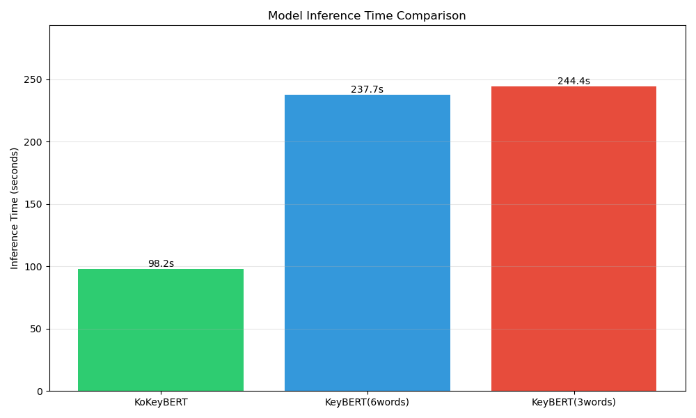 |

### 6.4 분석 및 결론

- #### 주요 성능 향상
  - F1 Score 개선: KoKeyBERT는 KeyBERT 대비 F1 Score에서 약 20%p(퍼센트 포인트) 향상이라는 매우 의미 있는 성능 개선을 달성했다. 이는 모델의 정확도(Precision)와 재현율(Recall)이 균형 있게 크게 향상되었음을 의미한다.
  - 추론 속도 향상: 동일 GPU 환경(NVIDIA T4)에서 비교했을 때, KoKeyBERT는 KeyBERT 대비 약 2.5배 빠른 추론 속도를 보였으며, 이는 효율성 측면에서도 뛰어난 성능을 입증하는 결과이다. 특히 이러한 속도 향상은 다음과 같은 데이터 처리 방식의 차이를 고려할 때 KoKeyBERT 모델 자체의 높은 연산 효율성을 더욱 부각시킨다. KeyBERT는 라이브러리 설계상 추론 시 전체 데이터를 메모리에 사전 적재하므로 데이터 로딩으로 인한 병목 현상이 거의 발생하지 않는다. 반면, KoKeyBERT는 표준적인 Dataloader 클래스를 사용하여 배치(batch) 단위로 데이터를 처리하는 과정에서 상대적으로 데이터 로딩 및 전처리로 인한 병목이 발생할 가능성이 있다. KoKeyBERT가 이러한 잠재적인 데이터 처리 병목에도 불구하고 KeyBERT보다 우월한 추론 속도를 달성했다는 점은 그 자체의 연산 효율성이 매우 뛰어남을 시사한다.

- #### 심층 분석
  - KeyBERT의 키워드 개수별 성능 변화: KeyBERT의 경우, 추출 대상 키워드 개수를 증가시켜도 F1 Score의 유의미한 개선으로 이어지지 않았으며, 오히려 과도하게 많은 키워드를 추천하려 할 때 정확도(Precision)가 하락하는 경향이 관찰되었다.
  - 입력 데이터 길이에 따른 성능 변화: 평가 데이터가 입력 텍스트의 길이를 기준으로 오름차순 정렬되어 있어, 평가 단계(step)가 진행됨에 따라 입력 텍스트 길이가 증가하는 특성이 있었다. 이로 인해 KoKeyBERT와 KeyBERT 모든 모델에서 텍스트 길이가 길어질수록 전반적인 성능 지표가 점진적으로 하락하는 경향이 공통적으로 나타났다.

- #### 한계점 및 향후 연구 방향
  - 본 연구를 통해 KoKeyBERT의 우수성을 확인했으나, 다음과 같은 한계점과 이를 극복하기 위한 향후 연구의 필요성을 인지했다.

  - 입력 길이 민감도: 분석에서 언급된 바와 같이, 입력 텍스트의 길이가 길어질수록 성능이 저하되는 경향은 KoKeyBERT에서도 완전히 극복되지는 못했다. 장문 텍스트에 대한 강인성(robustness) 확보는 향후 중요한 개선 과제이다.
  - 데이터셋 구성의 다양성 및 정답 일관성:
      - 이질적 데이터셋 통합: 연구에 사용된 전체 데이터셋은 서로 다른 특성을 가진 3개의 하위 데이터셋을 통합하여 구성되었다. 이로 인해 각 하위 데이터셋의 정답 레이블링 기준이나 키워드의 성격이 완전히 일치하지 않을 수 있다는 잠재적 한계가 존재한다.
      - 데이터셋 편향: 특정 하위 데이터셋(민원 데이터)이 전체의 약 80%라는 큰 비중을 차지한다. 이는 모델이 해당 특정 데이터셋의 패턴에 과적합(overfitting)되었을 가능성을 제기할 수 있다.
      - 긍정적 측면: 이러한 우려에도 불구하고, 제안 모델(KoKeyBERT)은 상대적으로 비중이 적은 다른 하위 데이터셋들에서도 KeyBERT 대비 일관되게 우수한 성능을 보였다. 이는 KoKeyBERT가 단순히 특정 패턴에만 강한 것이 아니라, 다양한 유형의 데이터에 걸쳐 전반적인 키워드 추출 능력이 향상되었음을 시사하며, 데이터 편향으로 인한 우려를 일정 부분 완화한다.
  - 정답 키워드 특성 (명사 중심): 사용된 데이터셋의 정답 키워드가 주로 명사로 구성되어 있다는 점을 고려할 때, EM(Exact Match) 기반의 평가는 명사 추출에 강점을 보이는 모델에 유리하게 작용할 수 있다. KeyBERT가 의미 있는 구(phrase) 형태의 키워드를 추출하더라도, 정답이 명사 중심일 경우 평가에서 불리했을 가능성을 고려해야 한다. 


## 7. 멤버
| 박준혁 | 이차현 | 임성표 |
|:-------:|:-------:|:-------:| 
|<a href="https://github.com/JakeFRCSE"></a>|<a href="https://github.com/chahyunlee"></a>|<a href="https://github.com/LimSungPyo"></a>|
| eppi001004@gmail.com | chahyun20@naver.com | lsp11121@gmail.com |
| 자연어처리 | 프론트엔드 | 백엔드 |