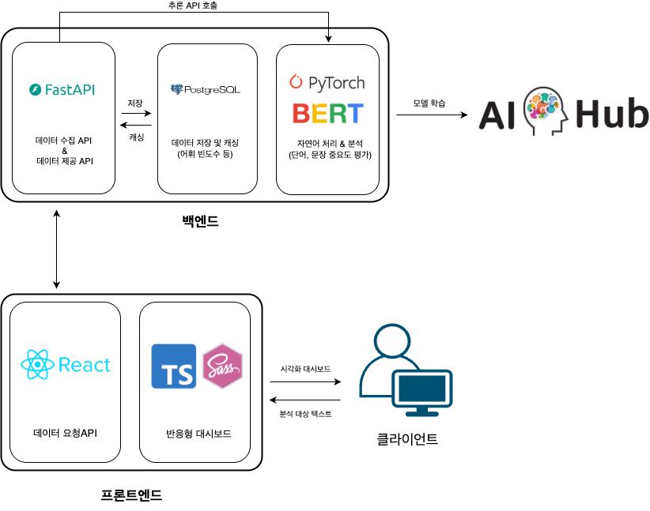
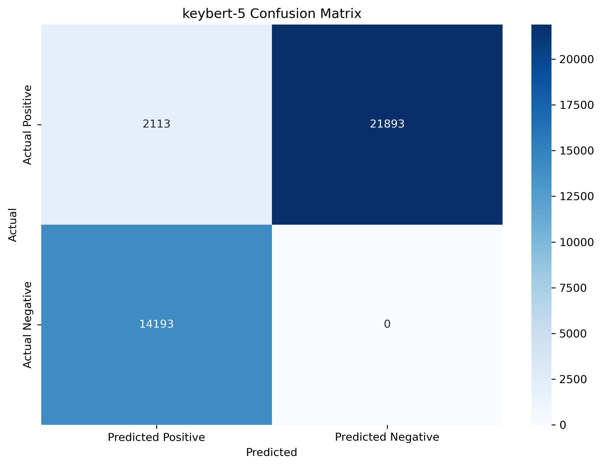
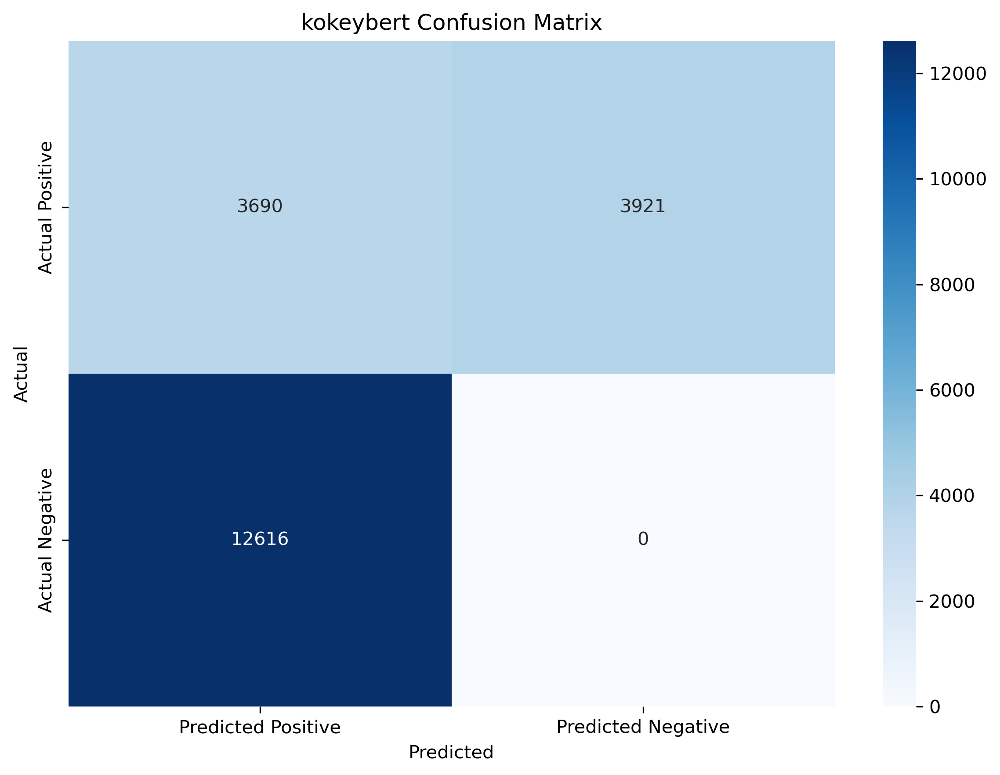
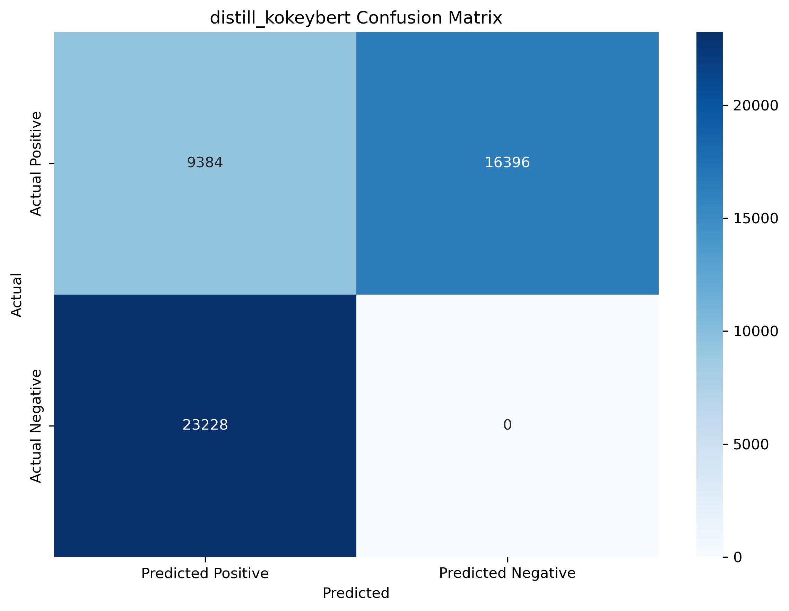
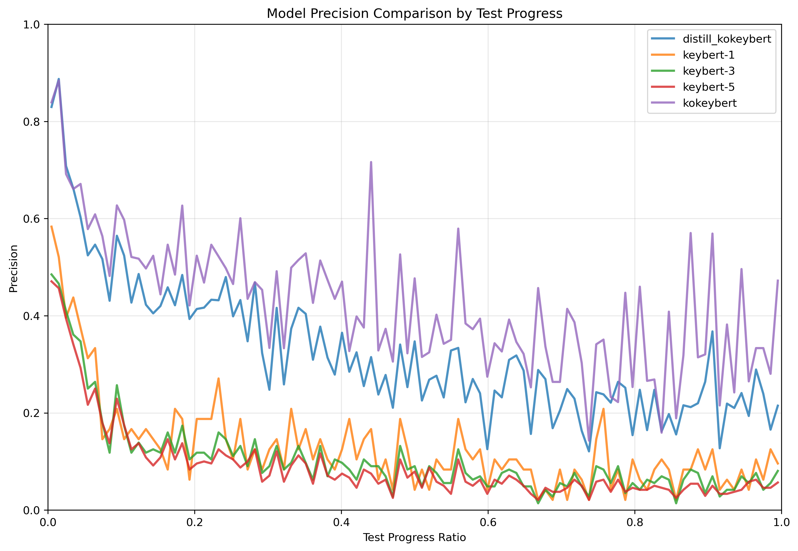
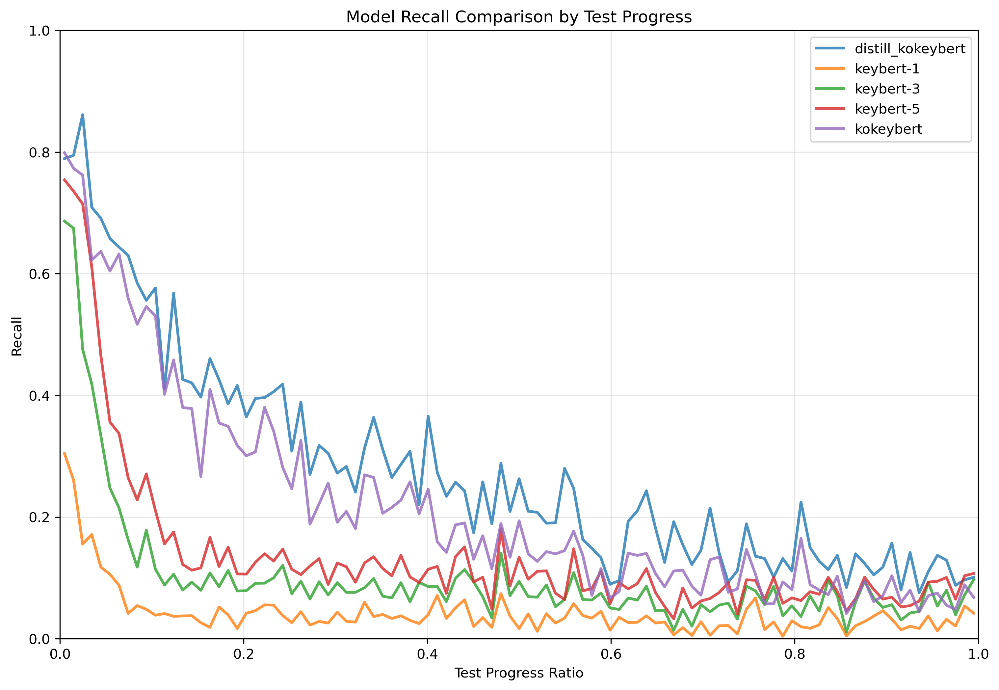
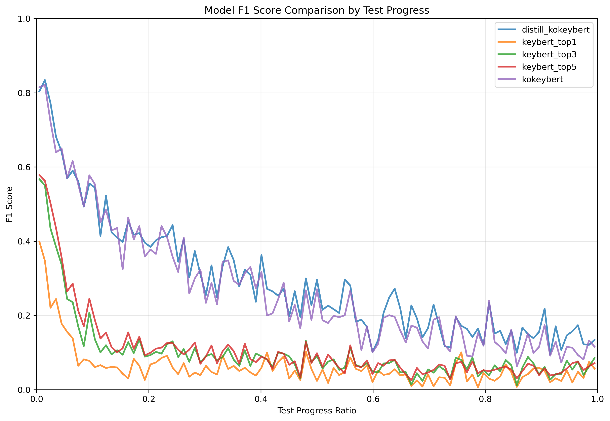
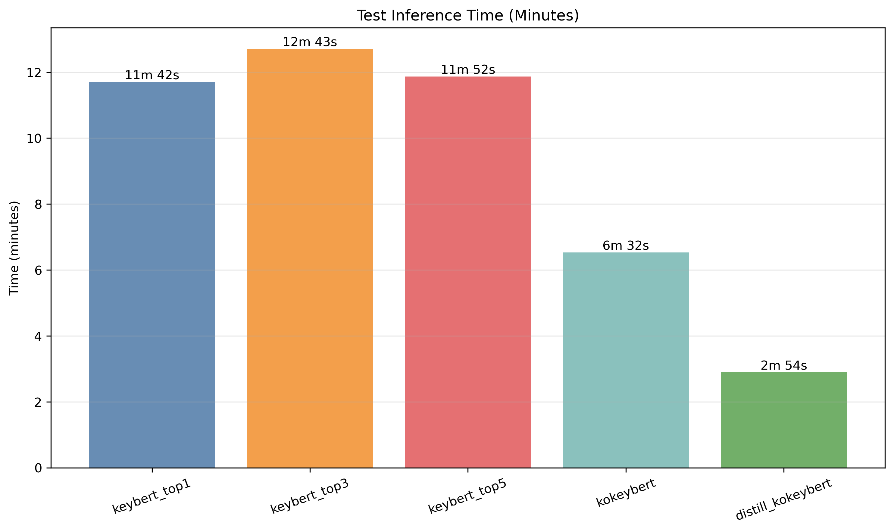

# 부산대학교 정보컴퓨터공학부 2025 전기 졸업과제


**KoKeyBERT (코키 버트) - 공공데이터를 활용한 한국어 키워드 추출 및 대시보드 시각화**

## 1. 프로젝트 배경

### 1.1. 국내외 시장 현황 및 문제점

#### 시장 현황
전 세계적으로 텍스트 분석 및 자연어 처리 시장은 급속도로 성장하고 있습니다. 특히 빅데이터 시대에 접어들면서 대량의 텍스트 데이터에서 핵심 정보를 추출하는 키워드 추출 기술의 중요성이 크게 증가하고 있습니다. 국내에서도 정부 기관, 언론사, 기업들이 문서 요약, 검색 최적화, 콘텐츠 분류 등의 목적으로 키워드 추출 기술을 활용하고 있습니다.

#### 기존 문제점
1. **계산 복잡도 문제**: 기존 KeyBERT는 전체 문서에 대한 CLS 토큰과 문서의 일부분에 대한 CLS 토큰 간의 벡터 유사도를 측정하는 방식으로, 입력 문장이 길어질수록 계산 시간이 기하급수적으로 증가합니다.

2. **도메인 특화 부족**: KeyBERT에서 사용하는 사전학습 모델들은 키워드 추출이라는 특정 태스크에 최적화되어 있지 않아, 도메인별 특수성을 충분히 반영하지 못합니다.

3. **한국어 처리의 한계**: 형태소 단위로 의미가 구성되는 한국어의 특성상, 조사를 고려하지 않는 키워드 추출 방식은 정확도가 현저히 떨어집니다.

4. **실시간 처리 어려움**: 대용량 텍스트 처리 시 응답 시간이 길어져 실제 서비스 환경에서 사용하기 어렵습니다.

### 1.2. 필요성과 기대효과

#### 필요성
- **한국어 특화 모델의 부재**: 한국어 텍스트에 최적화된 키워드 추출 모델의 필요성이 증대되고 있습니다.
- **공공데이터 활용 극대화**: 국내 공공기관에서 생산하는 대량의 한국어 텍스트 데이터를 효과적으로 분석할 수 있는 도구가 필요합니다.
- **실용성 확보**: 학술적 연구를 넘어 실제 서비스에서 사용 가능한 성능과 속도를 갖춘 모델이 요구됩니다.

#### 기대효과
1. **성능 향상**: KeyBERT 대비 F1 Score 20%p 향상으로 키워드 추출 정확도 대폭 개선
2. **처리 속도 개선**: 기존 대비 2.5배 빠른 추론 속도로 실시간 서비스 가능
3. **한국어 특화**: 한국어 형태소 분석과 문맥 이해를 통한 정확한 키워드 추출
4. **비용 효율성**: 지식 증류를 통한 경량화로 서버 비용 절약 및 에너지 효율성 증대

## 2. 개발 목표

### 2.1. 목표 및 세부 내용

#### 전체적인 개발 목표
한국어에 특화된 고성능 키워드 추출 모델을 개발하고, 이를 활용한 웹 기반 텍스트 분석 서비스를 구현하여 사용자가 쉽게 접근할 수 있는 한국어 텍스트 분석 플랫폼을 제공합니다.

#### 주요 기능
1. **키워드 추출**: KoBERT를 이용해 만든 딥러닝 모델로 정확한 한국어 키워드 추출
2. **키워드 설명**: 추출된 키워드가 선택된 이유를 설명하는 해석 가능한 AI 기능
3. **품사 분석 시각화**: 텍스트의 품사별 분포를 직관적으로 보여주는 시각화 기능
4. **실시간 분석**: 웹 인터페이스를 통한 즉시 텍스트 분석 및 결과 제공

#### 기획 내용
- **사용자 친화적 인터페이스**: React 기반의 직관적이고 반응형 웹 UI 제공
- **API 서비스**: FastAPI를 통한 RESTful API로 다양한 플랫폼에서 활용 가능
- **데이터베이스 연동**: PostgreSQL을 활용한 분석 결과 저장 및 관리
- **Docker 기반 배포**: 컨테이너화를 통한 쉬운 배포 및 확장성 확보

### 2.2. 기존 서비스 대비 차별성

#### 유사 서비스 비교
1. **KeyBERT**: 영어 중심, 계산 복잡도 높음, 도메인 특화 부족
2. **KoNLPy 기반 솔루션**: 통계적 방법론, 문맥 이해 부족
3. **상용 API 서비스**: 비용 부담, 데이터 보안 문제, 커스터마이징 한계

#### 차별점
1. **한국어 특화**: KoBERT 기반으로 한국어 형태소와 문맥을 정확히 이해
2. **성능 우수성**: 기존 KeyBERT 대비 F1 Score 20%p 향상
3. **속도 최적화**: 지식 증류를 통해 2.5배 빠른 처리 속도 달성
4. **해석 가능성**: 키워드 추출 근거를 사용자에게 명확히 제시
5. **오픈소스**: 무료 사용 가능하며 커스터마이징 자유도 높음
6. **통합 플랫폼**: 키워드 추출부터 시각화까지 원스톱 서비스 제공

### 2.3. 사회적 가치 도입 계획

#### 공공성
- **공공데이터 활용**: 국회 회의록, 법률 문서, 민원 데이터 등 공공데이터를 학습에 활용하여 공공 서비스 개선에 기여
- **무료 서비스**: 오픈소스로 공개하여 누구나 자유롭게 사용 가능
- **교육 활용**: 대학교 및 연구기관에서 한국어 자연어 처리 교육 자료로 활용

#### 지속 가능성
- **경량화 모델**: 지식 증류를 통한 모델 경량화로 서버 자원 사용량 최소화
- **효율적 아키텍처**: 마이크로서비스 아키텍처로 필요한 기능만 선택적 사용 가능
- **확장 가능성**: 모듈화된 설계로 새로운 기능 추가 및 성능 개선 용이

#### 환경 보호
- **에너지 효율성**: 경량화된 모델로 GPU 사용량 감소 및 전력 소비 절약
- **지속적인 최적화**: 모델 압축 기술 연구를 통한 지속적인 효율성 개선

## 3. 시스템 설계

### 3.1. 시스템 구성도


### 3.2. 사용 기술

#### 자연어 처리 (NLP)
- **Python**: 3.12.9
- **PyTorch**: 2.5.1 (stable)
- **Transformers**: 4.49.0 (Hugging Face)
- **TorchCRF**: 1.1.0 (CRF Layer)
- **KoBERT**: SKT Brain의 한국어 BERT 모델
- **Mecab**: 형태소 분석기 (python-mecab-ko 1.3.7)

#### 백엔드 (Backend)
- **FastAPI**: 0.115.0 ~ 0.116.0 (고성능 웹 프레임워크)
- **Pydantic**: 2.11.0 ~ 2.12.0 (데이터 검증)
- **SQLAlchemy**: 2.0.0 ~ 2.1.0 (ORM)
- **PostgreSQL**: 관계형 데이터베이스
- **Uvicorn**: ASGI 서버
- **Psycopg2**: PostgreSQL 드라이버

#### 프론트엔드 (Frontend)
- **React**: 18.2.0 (사용자 인터페이스 라이브러리)
- **TypeScript**: 5.8.3 (정적 타입 검사)
- **Vite**: 6.3.5 (빌드 도구)
- **React Router DOM**: 7.7.1 (라우팅)
- **D3.js**: 7.9.0 (데이터 시각화)
- **React D3 Cloud**: 1.0.6 (워드클라우드)
- **SCSS**: 스타일링
- **React Icons**: 5.5.0 (아이콘)

#### 배포 및 인프라
- **Docker**: 컨테이너화
- **Docker Compose**: 멀티 컨테이너 관리
- **PostgreSQL**: 데이터베이스 서버

## 4. 개발 결과

### 4.1. 기능 설명 및 주요 기능 명세서

#### 주요 기능 상세 설명

##### 1. 키워드 추출 기능
- **입력**: 한국어 텍스트 (최대 512 토큰)
- **출력**: 추출된 키워드 집합 (Set)
- **처리 방식**: KoBERT + CRF 기반 토큰 분류
- **특징**: 
  - 형태소 단위 분석으로 한국어 특성 반영
  - 문맥을 고려한 정확한 키워드 식별

##### 2. 키워드 설명 기능
- **입력**: 원본 텍스트 + 추출된 키워드
- **출력**: 키워드별 추출 근거 설명
- **처리 방식**: Attention 메커니즘 분석
- **특징**:
  - 모델의 의사결정 과정 투명화
  - 사용자 신뢰도 향상
  - 키워드 품질 검증 가능

##### 3. 품사 분석 시각화
- **입력**: 한국어 텍스트
- **출력**: 품사별 분포 차트 및 워드클라우드
- **처리 방식**: Mecab 형태소 분석기 활용
- **특징**:
  - 명사, 동사, 형용사 등 품사별 통계
  - 인터랙티브 시각화
  - 텍스트 특성 한눈에 파악 가능

##### 4. 실시간 웹 분석
- **입력**: 웹 인터페이스를 통한 텍스트 입력
- **출력**: 실시간 분석 결과 (키워드 + 시각화)
- **처리 방식**: FastAPI + React 연동
- **특징**:
  - 즉시 응답 (평균 3초 이내)
  - 반응형 UI로 모든 디바이스 지원
  - 분석 히스토리 저장 및 관리

#### 성능 지표

##### 모델별 성능 비교 (테스트 데이터: 4,845개 샘플)

| 모델명 | Precision | Recall | F1 Score | 추론 시간 (테스트 데이터셋에 대한 macbook m3 air 기준) |
|--------|-----------|--------|----------|-------------------|
| KeyBERT(5words) | 0.0880 | 0.1296 | 0.1048 | 11분 52초 |
| KoKeyBERT | 0.4848 | 0.2263 | 0.3086 | 6분 42초 |
| **DistillKoKeyBERT** | **0.3640** | **0.2877** | **0.3214** | **2분 54초** |

##### 주요 성능 향상
- **정확도**: F1 Score 0.3214 (KeyBERT 대비 22%p 향상)
- **처리 속도**: 2분 54초 (KeyBERT 대비 약 4배 빠름)
- **균형성**: Precision과 Recall의 균형 잡힌 성능
- **경량화**: Teacher 모델 대비 5.75배 빠른 추론 속도

##### 성능 비교 시각화

**모델별 혼동 행렬 (Confusion Matrix)**

|KeyBERT(5words)|KoKeyBERT|DistillKoKeyBERT|
|:---:|:---:|:---:|
|  |  |  |

**성능 지표 추이**

| Precision | Recall | F1 Score | Inference Time |
|-----------|---------|-----------|-----------|
|  |  |  |  |

### 4.2. 디렉토리 구조

```
2025_CSE_graduation_assignment/
├── back_end/                          # 백엔드 서버
│   ├── app/                           # FastAPI 애플리케이션
│   │   ├── __init__.py
│   │   ├── main.py                    # 메인 서버 파일
│   │   ├── models.py                  # 데이터베이스 모델
│   │   ├── schemas.py                 # Pydantic 스키마
│   │   ├── crud.py                    # 데이터베이스 CRUD 작업
│   │   ├── database.py                # 데이터베이스 연결 설정
│   │   ├── text_analysis.py           # 텍스트 분석 로직
│   │   ├── nlp/                       # NLP 모델 관련 파일
│   │   └── static/                    # 정적 파일
│   ├── Dockerfile                     # 백엔드 Docker 설정
│   └── requirements.txt               # Python 의존성 패키지
│
├── front_end/                         # 프론트엔드 웹 애플리케이션
│   ├── src/
│   │   ├── components/                # React 컴포넌트
│   │   │   ├── Drawer/               # 사이드바 컴포넌트
│   │   │   ├── FloatingSearch/       # 플로팅 검색 컴포넌트
│   │   │   └── SearchBar/            # 검색바 컴포넌트
│   │   ├── pages/                    # 페이지 컴포넌트
│   │   │   ├── Home/                 # 홈 페이지
│   │   │   └── Detail/               # 상세 분석 페이지
│   │   ├── api/                      # API 통신
│   │   │   ├── endpoints.ts          # API 엔드포인트 정의
│   │   │   └── services/             # API 서비스 로직
│   │   ├── types/                    # TypeScript 타입 정의
│   │   │   ├── analysis.ts           # 분석 관련 타입
│   │   │   ├── api.ts                # API 관련 타입
│   │   │   ├── common.ts             # 공통 타입
│   │   │   ├── ui.ts                 # UI 관련 타입
│   │   │   └── wordcloud.ts          # 워드클라우드 타입
│   │   ├── routes/                   # 라우팅 설정
│   │   ├── utils/                    # 유틸리티 함수
│   │   ├── styles/                   # 전역 스타일
│   │   └── data/                     # 모크 데이터
│   ├── public/                       # 정적 자원
│   ├── Dockerfile                    # 프론트엔드 Docker 설정
│   ├── package.json                  # Node.js 의존성
│   ├── tsconfig.json                 # TypeScript 설정
│   └── vite.config.ts                # Vite 빌드 설정
│
├── nlp/                              # 자연어 처리 모델
│   ├── src/                          # NLP 소스 코드
│   │   ├── data/                     # 데이터 처리
│   │   │   ├── dataset.py            # 데이터셋 클래스
│   │   │   ├── analysis.py           # 데이터 분석
│   │   │   └── preprocessing.ipynb   # 전처리 노트북
│   │   ├── models/                   # 모델 정의
│   │   ├── training/                 # 학습 관련 코드
│   │   └── utils/                    # 유틸리티 함수
│   ├── experiments/                  # 실험 관련
│   │   └── distillation/             # 지식 증류 실험
│   │       ├── colab/                # Google Colab 실험 코드
│   │       ├── distill_model.py      # 증류 모델 구현
│   │       ├── results/              # 실험 결과
│   │       └── utils/                # 실험 유틸리티
│   ├── models/                       # 학습된 모델 파일
│   │   ├── kokeybert_best.pt         # Teacher 모델
│   │   └── kokeybert_distilled.pt    # Student 모델
│   ├── results/                      # 평가 결과
│   │   ├── json/                     # JSON 형태 결과
│   │   └── plots/                    # 시각화 결과
│   ├── logs/                         # 학습 로그
│   └── tokenizer/                    # 토크나이저
│       └── kobert_tokenizer.py       # KoBERT 토크나이저
│
├── database/                         # PostgreSQL 데이터베이스 파일
│   ├── base/                         # 데이터베이스 기본 파일
│   ├── global/                       # 글로벌 설정
│   └── [PostgreSQL 시스템 파일들]
│
├── src/                              # 공통 자원
│   ├── data/                         # 학습/테스트 데이터
│   │   ├── train_clean.json          # 정제된 학습 데이터
│   │   └── test_clean.json           # 정제된 테스트 데이터
│   └── img/                          # 이미지 자원
│       ├── data_preprocessing/       # 데이터 전처리 관련 이미지
│       ├── training/                 # 학습 과정 이미지
│       ├── test/                     # 테스트 결과 이미지
│       ├── model_image.png           # 모델 로고
│       └── system_figure.png         # 시스템 구성도
│
├── compose.yaml                      # Docker Compose 설정
├── README.md                         # 프로젝트 설명서
└── README_final.md                   # 최종 보고서
```

## 5. 설치 및 실행 방법

### 5.1. 설치절차 및 실행 방법

#### 사전 요구사항
- Docker 및 Docker Compose 설치
- Git 설치
- 최소 8GB RAM, 10GB 디스크 여유 공간

#### 설치 및 실행 단계

##### 1. 프로젝트 클론
```bash
git clone https://github.com/your-repository/2025_CSE_graduation_assignment.git
cd 2025_CSE_graduation_assignment
```

##### 2. Docker Compose를 통한 전체 시스템 실행
```bash
# 전체 서비스 빌드 및 실행
docker-compose up --build
```

#### NLP 모델 학습 (선택사항)

##### Teacher 모델 학습:
```bash
cd nlp
python train.py --train_data_path training_data.json \
--batch_size 64 \
--split_ratio 0.1 \
--train_logger_name kokeybert_logger \
--num_warmup_steps 375 \
--val_freq 300 \
--save_freq 300
```

##### Student 모델 학습 (지식 증류):
```bash
cd nlp/experiments/distillation/colab
python real_distillation_gpu.py
```

### 5.2. 오류 발생 시 해결 방법

#### 자주 발생하는 오류 및 해결책

##### 1. Docker 관련 오류
```bash
# 포트 충돌 오류
Error: Port 8000 is already in use

# 해결방법: 사용 중인 포트 확인 및 종료
lsof -ti:8000 | xargs kill -9
docker-compose down
docker-compose up --build
```

##### 2. 데이터베이스 연결 오류
```bash
# 데이터베이스 연결 실패
sqlalchemy.exc.OperationalError: could not connect to server

# 해결방법: 데이터베이스 컨테이너 상태 확인
docker-compose ps
docker-compose up database -d
# 잠시 대기 후 백엔드 재시작
```

##### 3. 모델 파일 누락 오류
```bash
# 모델 파일을 찾을 수 없음
FileNotFoundError: No such file or directory: 'models/kokeybert_best.pt'

# 해결방법: 사전 학습된 모델 다운로드 또는 학습 실행
cd nlp
# 모델 학습 실행 또는 사전 학습된 모델 파일 다운로드
```

##### 4. 프론트엔드 빌드 오류
```bash
# Node.js 의존성 설치 실패
npm ERR! peer dep missing

# 해결방법: 의존성 재설치
cd front_end
rm -rf node_modules package-lock.json
npm install
npm run dev
```

##### 5. 메모리 부족 오류
```bash
# CUDA out of memory (GPU 환경)
RuntimeError: CUDA out of memory

# 해결방법: 배치 크기 줄이기
# nlp/train.py에서 batch_size를 32 또는 16으로 변경
```

#### 로그 확인 방법
```bash
# Docker 컨테이너 로그 확인
docker-compose logs backend
docker-compose logs frontend
docker-compose logs database

# 실시간 로그 모니터링
docker-compose logs -f backend
```

#### 시스템 리셋
```bash
# 전체 시스템 초기화
docker-compose down -v
docker system prune -a
docker-compose up --build
```

## 6. 소개 자료 및 시연 영상

### 6.1. 프로젝트 소개 자료
[발표자료 (PDF)](docs/03.발표자료/토마토주스%20발표%20자료.pdf)

### 6.2. 시연 영상
> 추후 작성 예정

## 7. 팀 구성

### 7.1. 팀원별 소개 및 역할 분담

| 박준혁 | 이차현 | 임성표 |
|:-------:|:-------:|:-------:| 
|<a href="https://github.com/JakeFRCSE"></a>|<a href="https://github.com/chahyunlee"></a>|<a href="https://github.com/LimSungPyo"></a>|
| eppi001004@gmail.com | chahyun20@naver.com | lsp11121@gmail.com |
| 자연어처리 | 프론트엔드 | 백엔드 |

#### 박준혁 (자연어처리 담당)
- **주요 역할**: 
  - KoKeyBERT 모델 설계 및 구현
  - 데이터 전처리 및 학습 파이프라인 구축
  - 지식 증류를 통한 모델 경량화
  - 모델 성능 평가 및 최적화
- **기술 스택**: Python, PyTorch, Transformers, KoBERT, CRF

#### 이차현 (프론트엔드 담당)
- **주요 역할**:
  - React 기반 사용자 인터페이스 설계 및 구현
  - TypeScript를 활용한 타입 안전성 확보
  - D3.js를 이용한 데이터 시각화 구현
  - 반응형 웹 디자인 및 사용자 경험 최적화
- **기술 스택**: React, TypeScript, SCSS, D3.js, Vite

#### 임성표 (백엔드 담당)
- **주요 역할**:
  - FastAPI 기반 RESTful API 서버 구축
  - PostgreSQL 데이터베이스 설계 및 관리
  - Docker를 이용한 컨테이너화 및 배포 환경 구성
  - NLP 모델과 웹 서비스 간 연동 구현
- **기술 스택**: FastAPI, PostgreSQL, Docker, SQLAlchemy

## 8. 참고 문헌 및 출처

### Software
1. [KoBERT](https://github.com/SKTBrain/KoBERT) - SKT Brain의 한국어 BERT 모델
2. [FastAPI](https://fastapi.tiangolo.com/) - 고성능 웹 프레임워크
3. [React](https://reactjs.org/) - 사용자 인터페이스 라이브러리
4. [PyTorch](https://pytorch.org/) - 딥러닝 프레임워크
5. [Transformers](https://huggingface.co/transformers/) - Hugging Face 자연어처리 라이브러리

### Papers
1. [DistilBERT, a distilled version of BERT: smaller, faster, cheaper and lighter](https://arxiv.org/pdf/1910.01108) - 지식 증류 기법의 이론적 기반
2. [BERT: Pre-training of Deep Bidirectional Transformers for Language Understanding](https://arxiv.org/pdf/1810.04805) - BERT 모델의 원리 및 구조
3. [What does BERT look at? An analysis of BERT's attention](https://arxiv.org/pdf/1906.04341) - BERT 어텐션 메커니즘 분석

### Datasets
1. **023.국회 회의록 기반 지식검색 데이터** - AI Hub 공공데이터
2. **143.민원 업무 효율, 자동화를 위한 언어 AI 학습데이터** - AI Hub 공공데이터  
3. **115.법률-규정 텍스트 분석 데이터_고도화_상황에 따른 판례 데이터** - AI Hub 공공데이터

### Websites
1. [Neuronpedia](https://www.neuronpedia.org) - 신경망 해석가능성 연구
2. [SHAP Library](https://shap.readthedocs.io/en/latest/example_notebooks/text_examples/sentiment_analysis/Positive%20vs.%20Negative%20Sentiment%20Classification.html) - 모델 해석 도구

### Tools and Libraries
1. [Mecab](https://bitbucket.org/eunjeon/mecab-ko/src/master/) - 한국어 형태소 분석기
2. [PostgreSQL](https://www.postgresql.org/) - 관계형 데이터베이스
3. [Docker](https://www.docker.com/) - 컨테이너 플랫폼
4. [D3.js](https://d3js.org/) - 데이터 시각화 라이브러리
