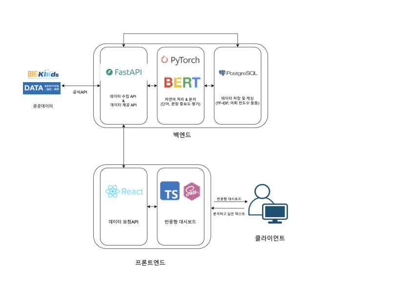

# 부산대학교 정보컴퓨터공학부 2025 전기 졸업과제 

## 1. 주제
#### 공공데이터를 활용한 KoBERT 파인튜닝과 한국어 키워드 분석 및 대쉬보드 시각화

## 2. 프로젝트 소개

### 2.1 개발 배경 및 필요성
자연어 처리(Natural Language Processing)의 발전과 함께 텍스트 마이닝의 중요성이 커지면서, 키워드 추출은 방대한 텍스트에서 핵심 정보를 요약하고 추출하는 데 필수적인 기술로 자리잡았다. 특히 뉴스 기사, SNS 게시글, 리뷰 등 다양한 텍스트 데이터가 실시간으로 생성되고 있는 현대 사회에서, 해당 텍스트의 중심 키워드를 정확하고 빠르게 파악하는 것은 매우 중요한 과제다. 

하지만 현재 널리 사용되는 키워드 추출 도구들(예: KeyBERT)은 영어 위주로 설계되어 있으며, 어순이 자유롭고 형태소가 복잡한 한국어의 특성을 제대로 반영하지 못하는 한계를 보이고 있다. 특히 KeyBERT는 입력 문장의 CLS 토큰과 각 토큰 간의 코사인 유사도를 기반으로 키워드를 추출하기 때문에 문장이 길어질수록 성능이 저하되고, 문맥에 맞지 않는 단어가 키워드로 선정되는 경우도 발생한다. 

이에 따라 본 프로젝트는 한국어에 특화된 사전학습 모델인 KoBERT를 활용하여, 한국어 문장에서의 키워드 추출 정확도를 높이고자 한다. 특히 BIO 태깅 방식과 CRF(Conditional Random Field) 레이어를 결합하여 문맥적 일관성과 키워드의 연속성을 강화함으로써, 한국어 문장에서의 키워드 단위 예측의 정확성과 안정성을 확보하고자 한다.

### 2.2 개발 목표
본 프로젝트의 목표는 다음과 같다:

- 한국어 텍스트에서 의미 있는 키워드를 정확하게 추출할 수 있는 인공지능 모델을 구축한다.
- KoBERT 모델을 기반으로 BIO 태깅 및 CRF를 활용하여 문맥 일관성이 높은 키워드 예측 시스템을 구현한다.
- 단순히 모델 구현에 그치지 않고, 키워드 분석 결과를 직관적으로 보여주는 웹 기반의 시각화 대시보드를 개발한다.
- 사용자는 텍스트를 입력하거나 이전 분석 결과를 불러올 수 있으며, 시스템은 실시간으로 키워드를 추출하고 이를 시각적으로 표현한다.

## 2. 시스템 구상도

## 3. 멤버
| 박준혁 | 이차현 | 임성표 |
|:-------:|:-------:|:-------:| 
||||
| eppi001004@gmail.com | chahyun20@naver.com | lsp11121@gmail.com |
| 자연어처리 | 프론트엔드 | 백엔드 |
